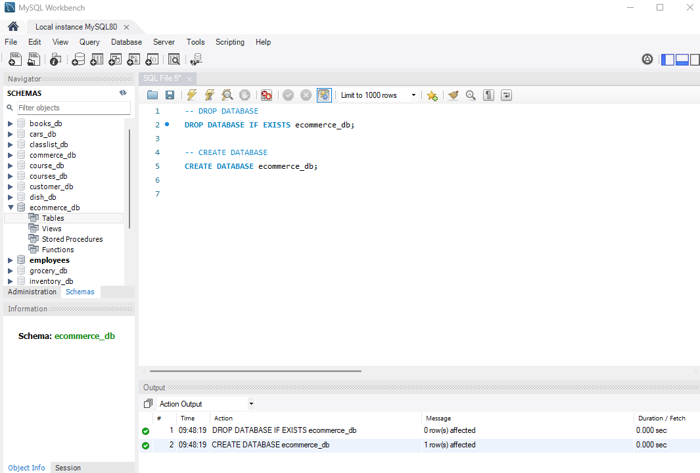
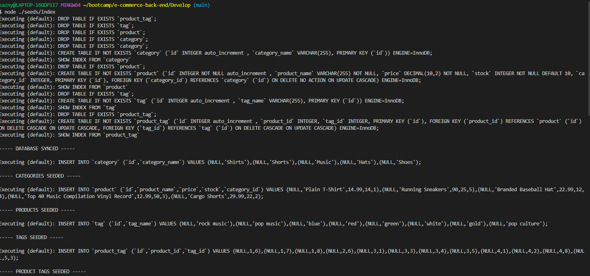
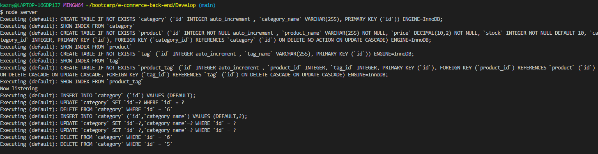
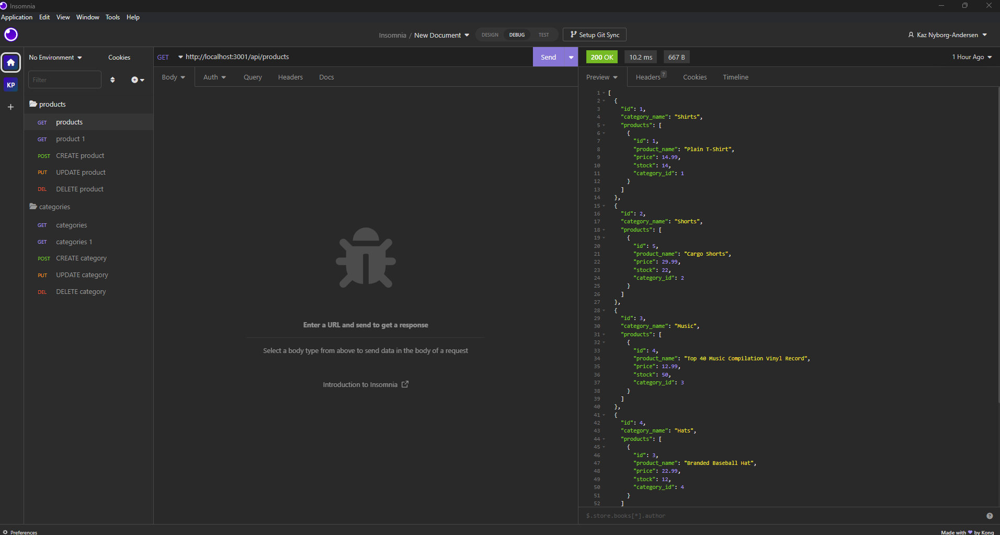

#E-Commerce-Back-End

## Description

Build the back end for an e-commerce site. Configure a working Express.js API to use Sequelize to interact with a MySQL database.

## Table of Contents (Optional)

- [Installation](#installation)
- [Usage](#usage)
- [Credits](#credits)
- [License](#license)

## Installation

The program will require and npm install. After the files are loaded the user will have to run the schema to generate the database needed. Then the user will run the seeds by executing node ./seeds/index.

## Usage

After the installation is completed the server will have to be spun up. This can be done by executing node server. Once the server is listening the user can use Insomnia to retrieve tags, categories, and products. The user can also use Insomnia to POST, PUT, and DELETE.

Video https://drive.google.com/file/d/1MmZQocBDeIPutujv-8SH0480q9gsmsRB/view

## Credits

Kaz Nyborg-Andersen https://github.com/kaznyborg

## License

MIT License

Copyright (c) [2023] [Kaz Nyborg-Andersen]

Permission is hereby granted, free of charge, to any person obtaining a copy
of this software and associated documentation files (the "Software"), to deal
in the Software without restriction, including without limitation the rights
to use, copy, modify, merge, publish, distribute, sublicense, and/or sell
copies of the Software, and to permit persons to whom the Software is
furnished to do so, subject to the following conditions:

The above copyright notice and this permission notice shall be included in all
copies or substantial portions of the Software.

THE SOFTWARE IS PROVIDED "AS IS", WITHOUT WARRANTY OF ANY KIND, EXPRESS OR
IMPLIED, INCLUDING BUT NOT LIMITED TO THE WARRANTIES OF MERCHANTABILITY,
FITNESS FOR A PARTICULAR PURPOSE AND NONINFRINGEMENT. IN NO EVENT SHALL THE
AUTHORS OR COPYRIGHT HOLDERS BE LIABLE FOR ANY CLAIM, DAMAGES OR OTHER
LIABILITY, WHETHER IN AN ACTION OF CONTRACT, TORT OR OTHERWISE, ARISING FROM,
OUT OF OR IN CONNECTION WITH THE SOFTWARE OR THE USE OR OTHER DEALINGS IN THE
SOFTWARE.